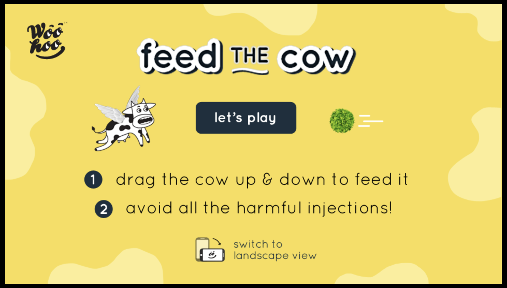
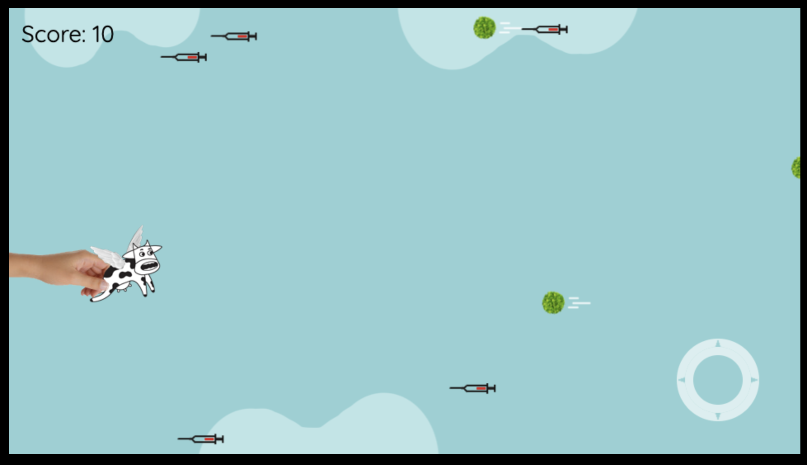
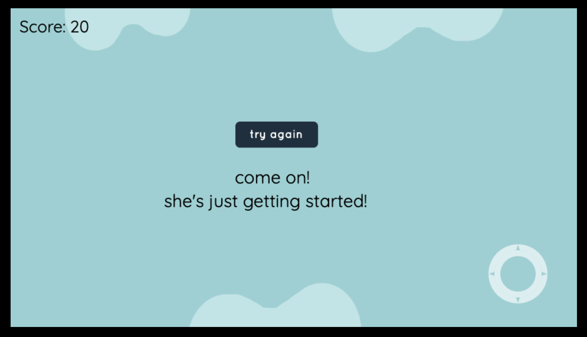

# Feed The Cow

A browser arcade game built with Phaser 2 for World Milk Day. Steer the cow up and down to eat green fodder and avoid the injections.

[](https://github.com/jadedm/feed-the-cow)

## Screenshots

<div align="center">

### Title screen


### Gameplay


### Game over


</div>

## About

The game was made to draw attention to what cattle eat. In India there is a large gap between the demand for feed and fodder and the supply. Many cows live on man-made concentrates, which raise milk output but harm the animal's health over time, so medicines and injections become routine.

The game makes the point directly: fresh green fodder keeps the cow going, and injections end the run.

## Features

- The background scrolls faster the longer you survive, following a square-root curve.
- Injection count climbs from 2 to 23 over the first 50 seconds.
- Three ways to control the cow: drag with mouse or touch, arrow keys, or an on-screen joystick.
- Runs in desktop and mobile browsers. The 960x540 canvas scales down to fit smaller screens, to a minimum of 480x260.
- Sound effects and background music.

## Controls

| Input | Action |
| --- | --- |
| Mouse or touch | Drag the cow up or down |
| Arrow keys | Up and down move the cow |
| On-screen joystick | Touch or click and drag, bottom right of the screen |

## How to play

1. Move the cow up and down to eat the green fodder.
2. Each piece of fodder scores 10 points.
3. Avoid the injections. One hit ends the game.
4. The background speeds up and more injections appear over time. Survive as long as you can.

## Getting started

### Prerequisites

- Node.js 20 or later. CI runs on Node 22.
- npm. The repo commits `package-lock.json`, and the Dockerfile runs `npm ci`, so use npm rather than yarn or pnpm.

### Run locally

```bash
git clone https://github.com/jadedm/feed-the-cow.git
cd feed-the-cow
npm ci
npm run dev
```

The dev server opens the game at `http://localhost:8000`.

### Production build

```bash
npm run build
npm run preview
```

Phaser loads images and sounds at runtime from paths such as `src/images/BG.png`. Vite cannot see those paths, so `npm run build` runs `vite build`, then `scripts/copy-runtime-assets.mjs`, which copies the images, audio, Phaser and the gamepad plugin into `dist/src/`, then `scripts/check-assets.mjs`, which fails the build if anything the game loads is missing. A new asset folder or script tag needs adding to the copy script.

`npm run deploy` builds and publishes `dist/` to the `gh-pages` branch.

### Docker

```bash
docker compose up --build
```

The game is served by nginx at `http://localhost:8080`.

## Tech stack

- Game engine: [Phaser 2](https://phaser.io/). This is Phaser 2, not Phaser 3; the APIs differ.
- Build tool: [Vite](https://vitejs.dev/)
- Language: JavaScript (ES modules)
- On-screen joystick: [Phaser Virtual Gamepad](https://github.com/ShawnHymel/phaser-plugin-virtual-gamepad), patched to run with a joystick and no button

## Project structure

```
feed-the-cow/
├── src/
│   ├── audio/          # Sound effects and music
│   ├── css/            # Stylesheets
│   ├── images/         # Sprites and backgrounds
│   ├── libs/           # Phaser and plugins, loaded as plain scripts
│   ├── Boot.js         # Canvas and scaling setup
│   ├── Preloader.js    # Asset loading
│   ├── StartMenu.js    # Title screen
│   └── Game.js         # Gameplay and tuning constants
├── screenshots/        # Images used in this README
├── index.html
├── main.js             # Creates the Phaser game and registers the states
├── scripts/            # Build helpers: asset copy and asset check
├── .github/            # CI workflow, issue and PR templates
├── vite.config.js
├── jsdoc.json
├── Dockerfile          # Two-stage build served by nginx
├── docker-compose.yml
├── nginx.conf
├── package.json
├── LICENSE             # MIT, for the code
├── NOTICE.md           # Art and audio reserved, third-party licenses
└── CONTRIBUTING.md
```

## API documentation

```bash
npm run docs
```

This writes JSDoc output to `docs/`. Open `docs/index.html` to read it.

## Game mechanics

### Speed

Background scroll speed is `3 + √(seconds) × 0.5` pixels per game step. The game logic runs 60 steps a second:

| Time | px/step | px/s |
| --- | --- | --- |
| 0s | 3 | 180 |
| 16s | 5 | 300 |
| 36s | 6 | 360 |
| 64s | 7 | 420 |

The speed has no upper limit. Fodder and injections move at the ground's speed plus their own, so they keep coming at the cow faster than the background as it accelerates: fodder 120 px/s over the ground, injections 245 px/s. Every item of a kind moves at the same speed, so two grass or two injections never run into each other, and each spawns in a clear spot. The speeds are constants near the top of `src/Game.js`.

### Injection spawning

| Time | Injections added | Total |
| --- | --- | --- |
| 0s | 2 | 2 |
| 10s | 1 | 3 |
| 20s | 2 | 5 |
| 30s | 2 | 7 |
| 40s | 3 | 10 |
| 45s | 5 | 15 |
| 50s | 8 | 23 |

These values live as named constants near the top of `src/Game.js`. Change them there to rebalance the game.

## Contributing

Bug reports and ideas go in [Issues](https://github.com/jadedm/feed-the-cow/issues). Questions and open-ended discussion go in [Discussions](https://github.com/jadedm/feed-the-cow/discussions).

[CONTRIBUTING.md](CONTRIBUTING.md) covers setup, how to check a change, and branch and commit conventions.

## License

The code is under the [MIT License](LICENSE).

The game's images, audio and screenshots, and the woohoo name, logo and campaign text, are not. They stay all rights reserved, so a fork you publish needs its own art, sound and text. [NOTICE.md](NOTICE.md) lists the exceptions and the third-party code (Phaser 2 and the Phaser Virtual Gamepad plugin, under their own licenses).

## Acknowledgments

- Made for World Milk Day.
- Built on the Phaser 2 game framework.
- Virtual gamepad plugin by [Shawn Hymel](https://github.com/ShawnHymel/phaser-plugin-virtual-gamepad).

---

Built by [Manish Jadhav](https://manishj.com). Need something like this designed or built? [Inoltro](https://inoltro.ai) is my studio.
